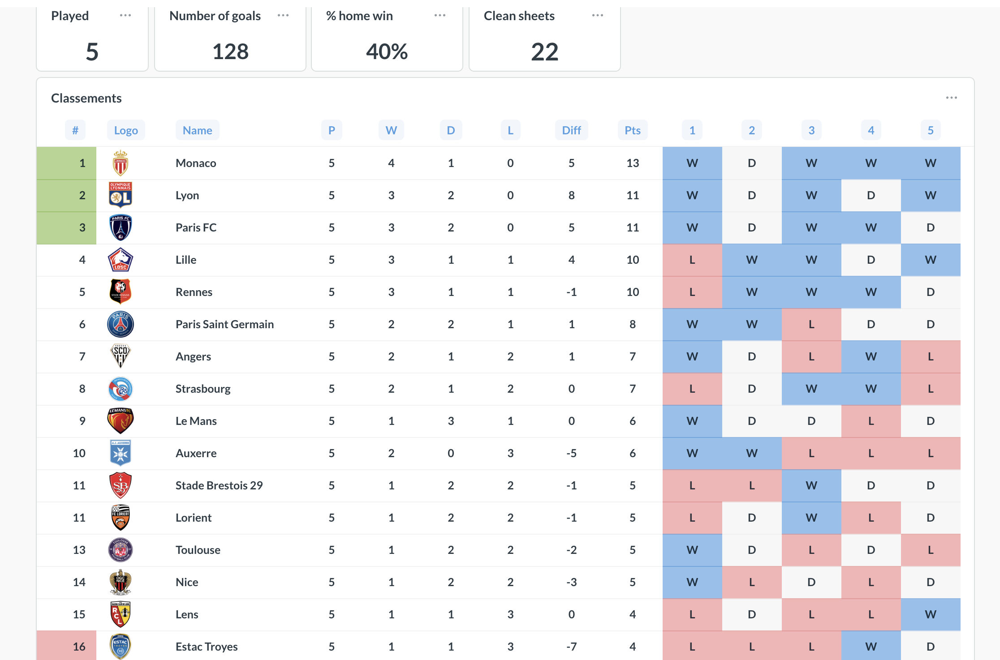
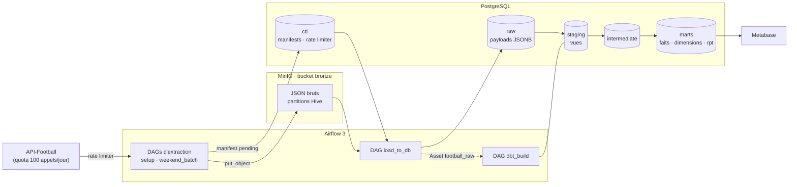
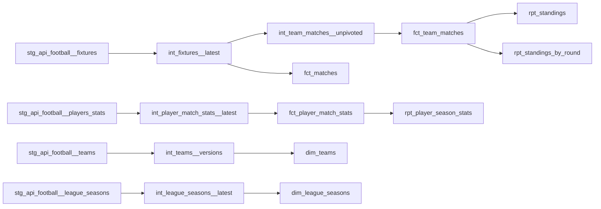

# ⚽ Football Data Platform

Plateforme data de bout en bout sur les données du football français (Ligue 1) : **ingestion d'une API sous quota**, **stockage brut immuable**, **modélisation dbt en couches** et **restitution BI**, le tout orchestré par Airflow et conteneurisé.

L'objectif n'est pas seulement de produire un classement : c'est de traiter les vrais problèmes d'un pipeline de production — quota d'API limité, rejouabilité, idempotence, historisation, qualité des données — avec des choix d'architecture **pragmatiques et justifiés**.



---

## Sommaire

- [Architecture](#architecture)
- [Stack technique](#stack-technique)
- [Flux de données](#flux-de-données)
- [Orchestration](#orchestration)
- [Modélisation dbt](#modélisation-dbt)
- [Choix d'architecture](#choix-darchitecture)
- [Qualité des données](#qualité-des-données)
- [Démarrage rapide](#démarrage-rapide)
- [Structure du projet](#structure-du-projet)
- [Conventions](#conventions)
- [État d'avancement](#état-davancement)

---

## Architecture



Trois principes structurent le projet :

1. **Ce qui ne se reconstruit pas est isolé** (`ctl`, `raw`, MinIO). Tout le reste (`staging`, `intermediate`, `marts`) est jetable et se recalcule à partir du raw.
2. **La logique vit dans dbt**, une seule fois. La BI ne fait qu'afficher.
3. **Chaque étape est idempotente** : rejouer une extraction, un chargement ou un build ne crée ni doublon ni régression.

---

## Stack technique

| Couche | Outil | Rôle |
|---|---|---|
| Source | [API-Football](https://www.api-football.com/) (via API-Sports / RapidAPI) | Ligues, équipes, matchs, statistiques joueurs |
| Orchestration | Apache Airflow 3 (TaskFlow, dynamic task mapping, Assets) | Planification, dépendances data-aware |
| Data lake | MinIO (S3-compatible) | Zone d'atterrissage brute et immuable |
| Warehouse | PostgreSQL 16 | Schémas `ctl`, `raw`, `staging`, `intermediate`, `marts` |
| Transformation | dbt-core + dbt-postgres, dbt_utils | Modélisation en couches, tests, documentation |
| Migrations | Alembic + SQLAlchemy 2 | Schémas opérationnels (`ctl`, `raw`) versionnés |
| Code | Python 3.12, Pydantic v2, uv | Client API typé, contrats de requêtes |
| Restitution | Metabase | Dashboards |
| Infra | Docker Compose | Stack locale reproductible |

---

## Flux de données

### 1. Extraction : API → MinIO

- Chaque requête est décrite par un **contrat Pydantic** (union discriminée par endpoint) qui valide les paramètres et calcule la clé de stockage.
- Le client HTTP est composé, pas hérité : `ApiClient` (HTTP) est enveloppé par `RateLimitedClient` (quota), derrière un `Protocol` commun.
- Le **rate limiter est persistant** (`ctl.api_rate_limiter`) : réservation avant l'appel, puis réconciliation avec les en-têtes `x-ratelimit-*` renvoyés par l'API. Le quota est donc partagé et respecté entre toutes les tâches parallèles.
- Les réponses sont écrites telles quelles dans MinIO, partitionnées façon Hive :

```
bronze/football_api/fixtures/players/league=61/season=2026/date=2026-09-27/fixture=1001148.json
```

- Une ligne est créée dans `ctl.api_extraction_manifest` (statut `pending`).

### 2. Chargement : MinIO → `raw`

- Le DAG `load_to_db` lit les entrées `pending` du manifest et charge chaque fichier en **JSONB** dans `raw.<endpoint>`.
- Le chargement est idempotent (`DELETE` + `INSERT` par `source_file` dans une transaction).
- Succès ou échec sont tracés dans le manifest (`attempts`, `last_error`, abandon après 3 tentatives).
- En fin de chargement, le DAG publie l'**Asset** `football_raw`, qui déclenche dbt.

### 3. Transformation : `raw` → `marts`

Voir [Modélisation dbt](#modélisation-dbt).

---

## Orchestration

| DAG | Planification | Rôle |
|---|---|---|
| `setup` | 1er mercredi du mois, 04:00 | Référentiels : ligue/saison, équipes, calendrier complet |
| `weekend_batch` | Ven → Lun, 02:00 | Matchs de la veille + statistiques joueurs (1 appel par match, en dynamic task mapping) |
| `load_to_db` | Toutes les heures | Chargement MinIO → `raw` depuis le manifest |
| `dbt_build` | Data-aware (Asset `football_raw`) | `dbt build` : modèles + tests, dans l'ordre du DAG dbt |

Le build dbt n'est **pas planifié à heure fixe** : il se déclenche quand de la donnée nouvelle est réellement arrivée.

---

## Modélisation dbt

### Couches

| Schéma | Matérialisation | Contenu | Règle |
|---|---|---|---|
| `raw` | table (Alembic) | 1 ligne par payload JSON | Immuable, source de vérité |
| `staging` | **vue** | 1 ligne par entité × payload | Dépilage du JSON, typage, renommage, lineage. **Aucune dédup, aucune règle métier** |
| `intermediate` | vue / **incrémental** | Points de vérité et logique réutilisée | Dédup, versionnage, pivots |
| `marts` | table | Schéma en étoile + tables de restitution | Vocabulaire métier, prêt à consommer |

### Modèles



| Modèle | Grain | Remarque |
|---|---|---|
| `fct_matches` | 1 ligne par match | Dernière version connue de chaque match |
| `fct_team_matches` | 1 ligne par équipe × match | Points, résultat (V/N/D), domicile/extérieur |
| `fct_player_match_stats` | 1 ligne par joueur × match | Minutes, note, tirs, passes, duels… |
| `dim_teams` | 1 ligne par **version** d'équipe | **SCD2** : `team_sk`, `valid_from`, `valid_to`, `is_current` |
| `dim_league_seasons` | 1 ligne par ligue × saison | Dates, saison courante, couverture de l'API |
| `rpt_standings` | 1 ligne par équipe × saison | Classement avec départages, forme sur 5 matchs |
| `rpt_standings_by_round` | 1 ligne par équipe × saison × journée | Évolution du classement |
| `rpt_player_season_stats` | 1 ligne par joueur × club × saison | Ratios par 90 minutes |

---

## Choix d'architecture

Les décisions importantes et leurs compromis.

### Staging en vues plutôt qu'en tables incrémentales

Le staging est la couche où l'on corrige le plus souvent du parsing (un champ JSON mal nommé, un type). En vue, **une correction s'applique immédiatement à tout l'historique**, sans `--full-refresh`. Le coût — re-parser le JSONB à chaque build — est négligeable à cette volumétrie (~380 matchs et ~12 000 lignes joueur × match par saison). Le passage en table est une ligne de configuration le jour où ce ne sera plus vrai.

### Un seul point de dédup, avec watermark et garde-fou

La dédup « dernière version par clé » est faite **une seule fois** (`int_*__latest`, incrémental) ; tous les modèles en aval lisent ce résultat.

- **Watermark** sur `loaded_at`, avec une **fenêtre de rattrapage** d'un jour : une ligne commitée en retard n'est jamais perdue, et le merge idempotent absorbe le recouvrement.
- **Ordre de dédup** sur `api_extracted_at` : on distingue *quand la donnée est arrivée* de *quand elle a été produite*.
- **Garde-fou anti-régression** : une version plus ancienne que celle déjà en table est ignorée. Rejouer un vieux fichier depuis MinIO ne peut pas remplacer un score final par « Not Started ».

### SCD2 calculée plutôt que snapshot dbt

Le raw conserve **toutes** les versions de chaque équipe. `int_teams__versions` reconstruit donc l'historique de façon déterministe (*gaps and islands* sur un hash des attributs métier) :

| | Snapshot dbt | SCD2 calculée |
|---|---|---|
| Rejouable (`--full-refresh`) | non | **oui** |
| `valid_from` | date du run dbt | **date de l'extraction** |
| Backfill d'anciens fichiers | ignoré | **intégré à sa date** |
| Correction d'un bug | historique figé | **recalculé** |

Un snapshot reste le bon outil pour une source mutable sans historique ; ce n'est pas le cas ici.

### Tout recalculer en aval

Hormis les deux modèles `__latest`, les marts sont reconstruits intégralement à chaque build. Un classement cumulé est un mauvais candidat à l'incrémental : corriger le résultat de la journée 3 modifie le rang de toutes les équipes sur toutes les journées suivantes. Avec quelques milliers de lignes, le recalcul complet est à la fois **plus simple et toujours juste**.

### NULL n'est pas zéro

Un match non joué a un score `NULL`, pas 0-0. Le staging ne décide rien ; c'est `int_team_matches__unpivoted` qui applique la règle métier « seul un match terminé rapporte des points ».

---

## Qualité des données

| Niveau | Tests |
|---|---|
| Staging | Unicité du grain (`entité × source_file`), `not_null` sur les clés, `accepted_values` sur les statuts de match (en `warn`) |
| Intermediate | Unicité des clés de dédup, une seule version courante par équipe, pas de chevauchement de périodes SCD2 |
| Marts | Exactement 2 lignes par match terminé dans `fct_team_matches`, `relationships` faits → dimensions, cohérences métier (`passes_accurate <= passes_total`) |
| Sources | `dbt source freshness` sur `raw.*.loaded_at` |
| Réconciliation | Classement calculé comparé à l'endpoint `standings` de l'API |

`dbt build` exécute modèles et tests dans l'ordre du DAG : un test en échec bloque la propagation vers les modèles en aval.

---

## Démarrage rapide

### Prérequis

- Docker et Docker Compose
- [uv](https://docs.astral.sh/uv/) (pour Alembic en local)
- Une clé API [API-Football](https://www.api-football.com/) (offre gratuite : 100 appels/jour)

### Installation

```bash
# 1. Configuration
cp .env.example .env
# → renseigner les clés API, les mots de passe et la FERNET_KEY

# 2. Démarrer la stack
docker compose up -d --build

# 3. Créer les schémas ctl et raw
uv sync
uv run alembic upgrade head

# 4. Installer les packages dbt
docker compose exec airflow-scheduler bash -c \
  "cd /opt/dbt/football_dbt && /home/airflow/dbt-venv/bin/dbt deps"
```

### Accès

| Service | URL |
|---|---|
| Airflow | http://localhost:8081 |
| MinIO (console) | http://localhost:9001 |
| PostgreSQL | `localhost:5433` |

### Premier chargement

1. Dans Airflow, déclencher le DAG **`setup`** (ligue, équipes, calendrier).
2. Déclencher **`load_to_db`** : le chargement publie l'Asset et lance `dbt_build`.
3. Les statistiques des matchs arrivent ensuite avec **`weekend_batch`**.

---

## Structure du projet

```
.
├── airflow/
│   └── dags/
│       ├── api_extraction_setup.py      # référentiels mensuels
│       ├── api_extraction_batch.py      # matchs + stats du week-end
│       ├── load_to_db.py                # MinIO → raw
│       ├── dbt_build.py                 # déclenché par l'Asset football_raw
│       └── common/                      # tâche d'extraction, Assets
├── src/
│   ├── common/                          # settings Pydantic, clients Postgres / MinIO
│   ├── connectors/
│   │   ├── api/                         # client HTTP, rate limiting, contrats de requêtes
│   │   ├── storage/                     # MinIO
│   │   └── database/                    # chargement raw
│   └── db/control/                      # modèles SQLAlchemy, manifests, rate limiter
├── alembic/                             # migrations des schémas ctl et raw
├── football_dbt/
│   ├── models/
│   │   ├── staging/                     # vues stg_
│   │   ├── intermediate/                # int_
│   │   └── marts/
│   │       ├── core/                    # fct_, dim_
│   │       └── reporting/               # rpt_
│   ├── macros/
│   ├── analyses/                        # requêtes d'exploration (ex. profilage des clés JSON)
│   └── packages.yml
├── scripts/                             # init MinIO, Postgres, Airflow
├── docker-compose.yml
├── dockerfile
└── pyproject.toml
```

---

## Conventions

**Modèles dbt**

| Couche | Pattern | Exemple |
|---|---|---|
| Staging | `stg_<source>__<entité>` | `stg_api_football__fixtures` |
| Intermediate | `int_<entité>__<transformation>` | `int_fixtures__latest`, `int_teams__versions` |
| Faits | `fct_<processus>` | `fct_team_matches` |
| Dimensions | `dim_<entité>` | `dim_teams` |
| Restitution | `rpt_<usage>` | `rpt_standings` |

**Colonnes**

- `<entité>_id` : identifiant naturel de l'API ; `<entité>_sk` : clé de substitution (dimensions SCD2 uniquement)
- `is_` / `has_` : booléens · `_at` : `timestamptz` en UTC · `_date` : date · `_pct` : pourcentage
- Lineage conservé jusqu'aux marts : `source_file`, `api_extracted_at`, `loaded_at`
- Tables au pluriel, colonnes au singulier, snake_case anglais

---

## État d'avancement

**Fait**

- [x] Stack Docker Compose (Airflow 3, PostgreSQL, MinIO)
- [x] Client API composé, contrats Pydantic, rate limiter persistant
- [x] Bronze MinIO partitionné, manifest d'extraction avec reprises
- [x] Chargement idempotent vers `raw`, déclenchement de dbt par Asset
- [x] Migrations Alembic des schémas opérationnels

**En cours**

- [ ] Refonte du staging en vues (parsing, typage, tests de grain)
- [ ] Couche intermediate : dédup incrémentale, SCD2 des équipes
- [ ] Marts en étoile et tables de restitution

**À venir**

- [ ] Dashboards Metabase (saison, fiche club, joueurs, santé du pipeline)
- [ ] Réconciliation avec l'endpoint `standings`
- [ ] Tests unitaires Python (rate limiter, contrats) et CI GitHub Actions (ruff, pytest, `dbt build`)
- [ ] Rendu public des dashboards

---
